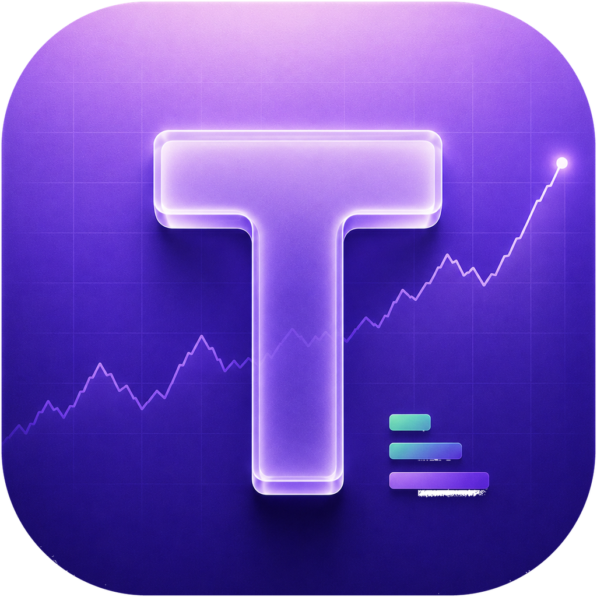
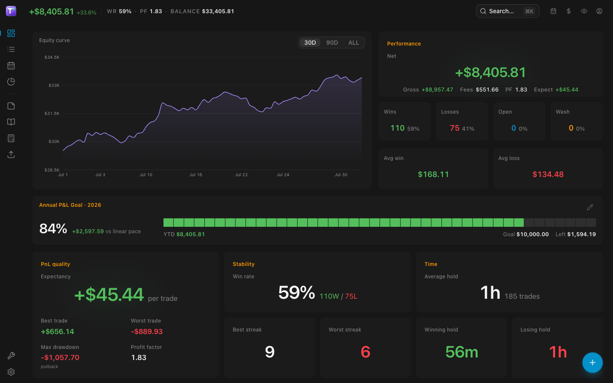
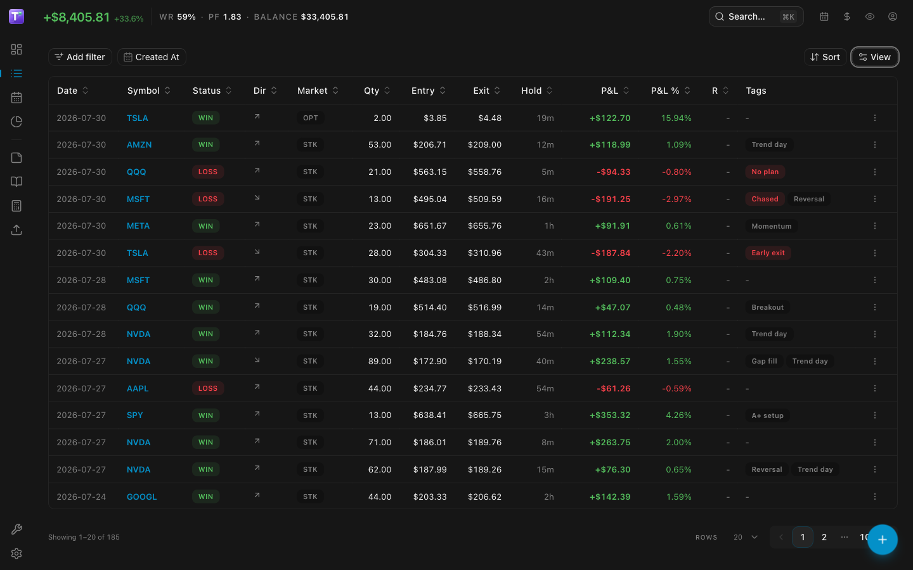
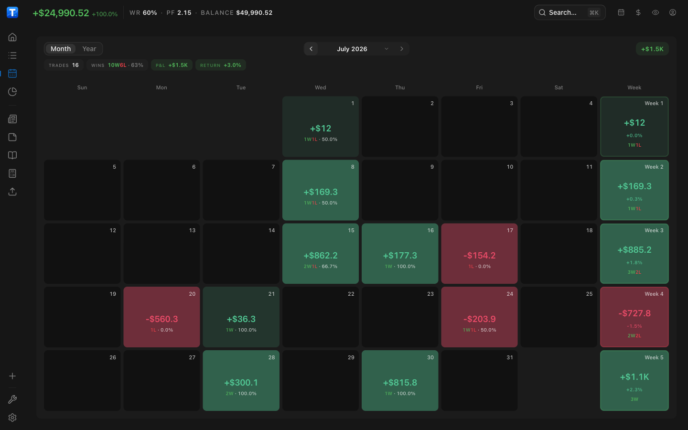
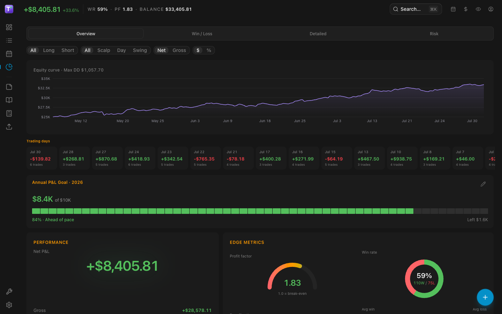
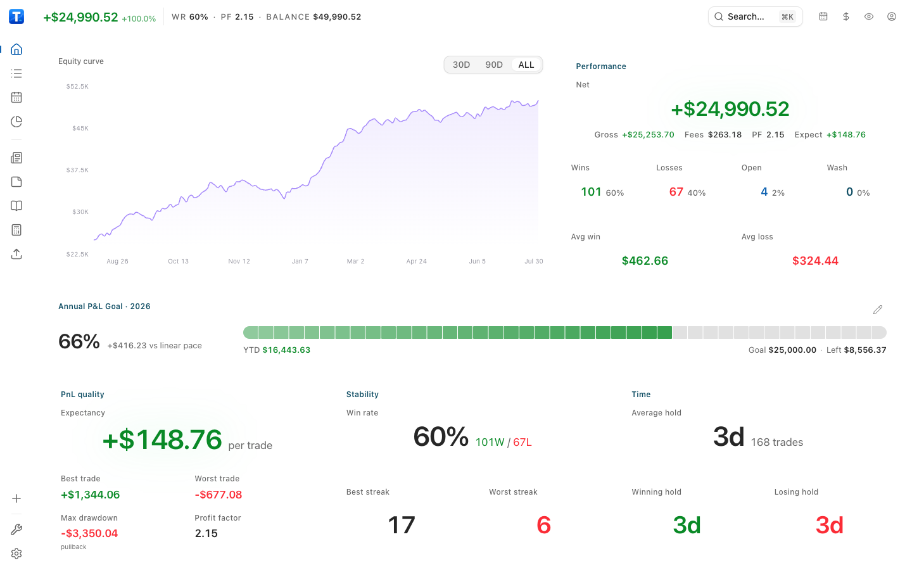
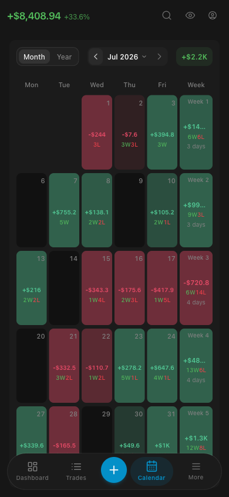

<div align="center">



# TraderMemos

### Own your data. Review your edge.

**A self-hosted trading journal for traders who want their performance data on their own infrastructure** — dashboard, P&L calendar, trade log, playbook, and reports. No subscription, no vendor lock-in.

<br/>

[](https://github.com/sinhong2011/TraderMemos/releases) [](https://github.com/sinhong2011/TraderMemos/actions/workflows/web-ci.yml) [](LICENSE)

[](api/go.mod) [](web/) [](api/) [](docs/fork-deploy.md)

<br/>

[](https://vercel.com/new/clone?repository-url=https%3A%2F%2Fgithub.com%2Fsinhong2011%2FTraderMemos&root-directory=web&project-name=tradermemos&repository-name=tradermemos&env=VITE_API&envDescription=Optional%20API%20base%20URL%20(e.g.%20https%3A%2F%2Fapi.example.com%2Fapi%2Fv1).%20Leave%20empty%20to%20set%20Server%20at%20login.&envLink=https%3A%2F%2Fgithub.com%2Fsinhong2011%2FTraderMemos%2Fblob%2Fmain%2Fdocs%2Ffork-deploy.md) [](https://deploy.workers.cloudflare.com/?url=https%3A%2F%2Fgithub.com%2Fsinhong2011%2FTraderMemos%2Ftree%2Fmain%2Fweb) [](https://app.netlify.com/start/deploy?repository=https://github.com/sinhong2011/TraderMemos) [](https://railway.com/new/template?template=https%3A%2F%2Fgithub.com%2Fsinhong2011%2FTraderMemos&utm_medium=integration&utm_source=button&utm_campaign=tradermemos)

<br/>

[Quick start](#quick-start) · [Fork guide](docs/fork-deploy.md) · [Contributing](CONTRIBUTING.md) · [Design](DESIGN.md) · [License](LICENSE)

<br/>



</div>

---

## A look inside

<table>
<tr>
<td width="50%">

<p align="center"><strong>Trade log</strong><br/><sub>Every fill grouped into trades — filter, sort, tag, and drill into execution detail.</sub></p>
</td>
<td width="50%">

<p align="center"><strong>P&L calendar</strong><br/><sub>Daily and weekly heatmap. Spot the streaks and the bad days at a glance.</sub></p>
</td>
</tr>
</table>



<p align="center"><strong>Reports</strong><br/><sub>Equity curve, profit factor, expectancy, win rate, and goal pacing — plus breakdowns by setup, hour, and session.</sub></p>

<table>
<tr>
<td width="74%" valign="top">

<p align="center"><strong>Light theme</strong><br/><sub>Dark by default; both themes ship from the same token set.</sub></p>
</td>
<td width="26%" valign="top">

<p align="center"><strong>Responsive</strong><br/><sub>Every screen works at phone widths.</sub></p>
</td>
</tr>
</table>

<p align="center"><sub><em>Screenshots show a generated demo dataset, not real trading results. Reproduce it with <code>scripts/seed-demo.py</code>.</em></sub></p>

---

## Live demo

Try TraderMemos without installing anything: **[tradermemos.netlify.app](https://tradermemos.netlify.app)**

Sign in with `tradermemosdemo` / `demopassword`. The demo account carries the same seeded dataset as the screenshots — treat it as a shared sandbox, and don't store anything real in it.

If TraderMemos is part of your daily review, consider [sponsoring its development](https://github.com/sponsors/sinhong2011) — it keeps the project free and self-hosted for everyone.

---

## Why TraderMemos?

Cloud journals like **TradeZella** and **TraderSync** are polished — but your edge lives in the data.

TraderMemos brings to performance review what **[Ghost](https://github.com/TryGhost/Ghost)** did for publishing, **[Umami](https://github.com/umami-software/umami)** for analytics, and **[Plane](https://github.com/makeplane/plane)** for project tracking: run it on your infrastructure, own the database, extend it without asking permission. The interaction bar is set by **[Linear](https://linear.app)** and **[Cal.com](https://github.com/calcom/cal.com)** — applied to a trading terminal.

| | Cloud journals | TraderMemos |
|---|---|---|
| **Data ownership** | Vendor-hosted | Your SQLite / VPS |
| **Cost** | Monthly subscription | Free + your hosting |
| **AI keys** | Often vendor-managed | Your OpenAI-compatible API |
| **Customization** | Limited | Fork, patch, deploy |

## Features

| Feature | What it does |
|---|---|
| 📊&nbsp; **Home** | Equity curve, expectancy, streaks, hold times, and annual goal pacing |
| 📒&nbsp; **Trade log** | Fills grouped into trades — filter, sort, tag, and drill into execution detail |
| 🗓&nbsp; **P&L calendar** | Daily and weekly heatmap with drill-down |
| 📈&nbsp; **Reports** | Win rate, profit factor, expectancy, and setup / hourly / session breakdowns |
| 📖&nbsp; **Playbook** | Strategy library linked to the trades that used each setup |
| 📥&nbsp; **Import** | CSV broker statements, with column mapping and dedup |
| 🧮&nbsp; **Tools** | Position-size calculator, risk rules, cash ledger |
| 🤖&nbsp; **AI** *(optional)* | Screenshot fill extraction + trade coach via OpenAI-compatible APIs — your keys |
| 🔌&nbsp; **API access** | Personal access tokens (`tm_pat_…`) for MCP/scripts; OpenAPI docs at `/docs` |
| 🌗&nbsp; **Themes** | Dark and light, built on shadcn/ui + [coss ui](https://coss.com/ui/docs) tokens |

## Tech stack

| Layer | Stack |
|-------|-------|
| **API** | Go · Echo · sqlc · golang-migrate · SQLite |
| **Web** | React · Vite+ · TanStack Router/Query/Form · Tailwind |
| **Mobile** | Expo (planned) |
| **Design** | shadcn/ui + coss ui tokens — see [DESIGN.md](DESIGN.md) |

## Quick start

Web UI and API in one container, on your own machine:

```bash
git clone https://github.com/sinhong2011/TraderMemos.git
cd TraderMemos
make up          # → http://localhost:3000
```

That's it. Same-origin `/api` — no CORS, leave the **Server** field blank. On first visit the **setup wizard** creates your owner account.

<details>
<summary><strong>Options and production notes</strong></summary>

<br/>

```bash
cp .env.example .env   # optional: DOCKERHUB_USERNAME, TM_IMAGE_TAG
make up                # pull prebuilt images from Docker Hub
make up-build          # or build both images from this repo
```

For production, set `TM_JWT_SECRET=$(openssl rand -hex 32)` and put TLS (Caddy/Traefik) in front — see [docs/deploy.md](docs/deploy.md).

</details>

## Deploy to the cloud

Prefer a hosted SPA with the API elsewhere? The buttons at the top split the app across two hosts:

| Button | Deploys |
|--------|---------|
| Vercel / Cloudflare / Netlify | Web SPA (`web/`) |
| Railway | Go API ([`railway.toml`](railway.toml) → `api/Dockerfile`) — attach a Volume at `/data` |

**1. Deploy the web UI** — click a button above; it hosts the SPA on **your** account.

**2. Run the API** — use the Railway button, or point it at any host running `api/Dockerfile`.

**3. Connect them** — allow your CDN origin on the API:

```bash
TM_CORS_ORIGINS=https://*.vercel.app,https://*.pages.dev,https://*.workers.dev,https://*.netlify.app,https://*.up.railway.app,http://localhost:5173
```

Then open the web app and set **Server** to your API URL (or bake it in with `VITE_API` at build time).

Already forked? Import your fork → Root **`web`** (Vercel/CF) or [`netlify.toml`](netlify.toml) / [`railway.toml`](railway.toml). Details: [docs/fork-deploy.md](docs/fork-deploy.md).

## Development

```bash
git clone https://github.com/sinhong2011/TraderMemos.git
cd TraderMemos
make setup && make dev   # API :8080 + web :5173
```

See [CONTRIBUTING.md](CONTRIBUTING.md) for targets, Vite+ commands, and project structure.

### Demo data

Fill any instance with ~200 generated trades over the last three months — the dataset in the screenshots above:

```bash
make demo-seed API=http://localhost:3000/api/v1 EMAIL=you@example.com PASSWORD='…'
```

It talks to the public API only, so it works against a local stack or a deployed demo. Re-running is a no-op — fills are deduplicated server-side.

## Docs

| Doc | Topic |
|-----|--------|
| [docs/fork-deploy.md](docs/fork-deploy.md) | One-click / fork → Vercel, Cloudflare, Netlify, Railway |
| [docs/deploy.md](docs/deploy.md) | Docker, CORS, edge rewrite |
| [docs/release.md](docs/release.md) | Versioning, changelogs, GitHub Releases |
| [CONTRIBUTING.md](CONTRIBUTING.md) | Local dev (`make dev`) |
| [DESIGN.md](DESIGN.md) | UI system — shadcn/ui + coss ui tokens |

## Star history

<div align="center">
<a href="https://www.star-history.com/#sinhong2011/TraderMemos&Date">
  <picture>
    <source media="(prefers-color-scheme: dark)" srcset="https://api.star-history.com/svg?repos=sinhong2011/TraderMemos&type=Date&theme=dark" />
    <source media="(prefers-color-scheme: light)" srcset="https://api.star-history.com/svg?repos=sinhong2011/TraderMemos&type=Date" />
    
  </picture>
</a>
</div>

## License

[AGPL-3.0](LICENSE). Self-host it, modify it, and run it for yourself or your firm freely. If you run a modified version as a network service for others, you have to publish those changes.
