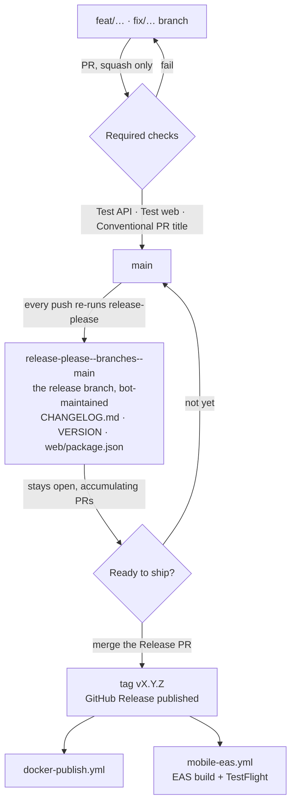
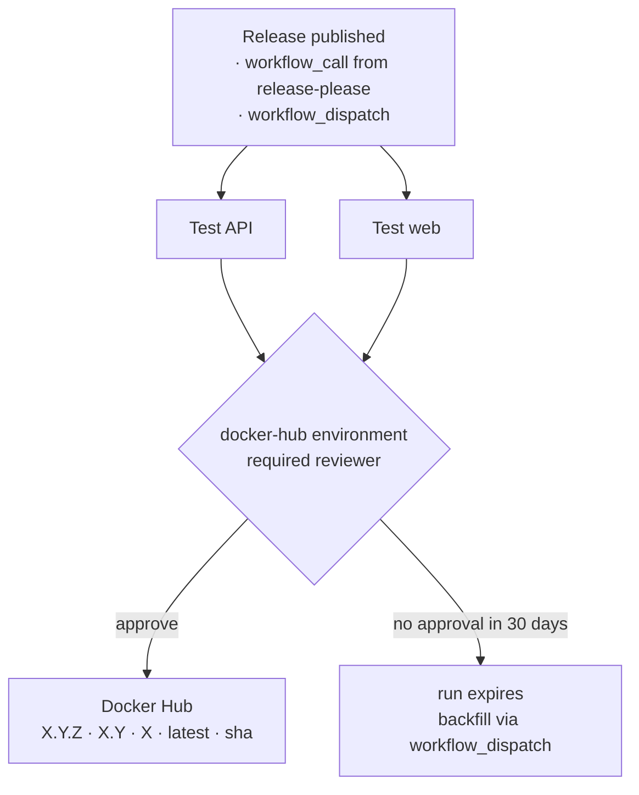
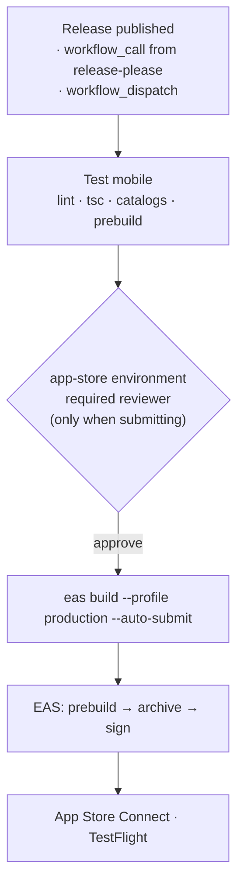

# Release workflow

TraderMemos uses [release-please](https://github.com/googleapis/release-please) for semver, changelogs, and GitHub Releases.



There is no hand-cut release branch: `release-please--branches--main` **is** the
release branch, rebuilt from scratch on every push to `main`. Merging it is the
release. Nothing else tags or publishes.

A GitFlow-style `release/x.y.z` merged into `main` is not possible here and is
not wanted — the ruleset requires linear history and squash-only merges, so the
merge commit it depends on is blocked. Squashing a release branch would also
collapse its commits into one subject, destroying the individual `feat:` / `fix:`
lines release-please reads to build the changelog.

## Day to day

1. Merge PRs to `main` with **Conventional Commit** titles. Merges are
   squash-only and the PR title becomes the commit subject; the
   "Conventional PR title" check blocks non-conventional titles.
2. release-please opens or updates a **Release PR** (`chore: release X.Y.Z`),
   and keeps it current as further PRs land. Leave it open until a release is
   actually wanted — it is a standing draft, not a queue to drain.
3. Review the changelog and version bumps (`VERSION`, `web/package.json`, `CHANGELOG.md`).
4. Merge the Release PR → GitHub Release `vX.Y.Z` is created.
5. Approve the `docker-hub` deployment → Docker images are published.
6. Approve the `app-store` deployment → the iOS app builds on EAS and goes to
   TestFlight (see [Mobile releases](#mobile-releases)).

## Commit messages

| Prefix | Semver bump (pre-1.0) | Example |
|--------|----------------------|---------|
| `fix:` | patch | `fix: healthz version lookup` |
| `feat:` | minor | `feat: about tab updates section` |
| `feat!:` / `fix!:` + `BREAKING CHANGE:` | major | `feat!: remove legacy import API` |
| `chore:`, `docs:`, `refactor:` | none | `chore: bump vite` |

`feat:` bumps **minor** (`0.1.13` → `0.2.0`) and `fix:` bumps **patch**, so the
version says which kind of change shipped. Set
`bump-patch-for-minor-pre-major: true` in `release-please-config.json` to send
pre-1.0 `feat:` back to patch.

### Force a version

Add to the PR description (it becomes the squash-merge commit body):

```text
Release-As: 0.2.0
```

### Release notes granularity

Each release lists the conventional commits merged since the previous tag.
Merging the Release PR after every feature PR yields one-line releases and a
`chore: release` commit between every pair of real ones; letting 5–10 PRs
accumulate yields fuller notes and a readable `main` history. Prefer the latter.

## Version files

| File | Purpose |
|------|---------|
| `VERSION` | Source of truth for API + web builds |
| `web/package.json` | Kept in sync by release-please |
| `mobile/package.json` | Kept in sync by release-please |
| `mobile/app.json` (`expo.version`) | Marketing version of the iOS build — kept in sync by release-please |
| `CHANGELOG.md` | Human-readable release notes |
| `.release-please-manifest.json` | Last released version (managed by release-please) |

The iOS **build number** is not in this table: `eas.json` sets
`appVersionSource: "remote"`, so EAS owns it and auto-increments it per
production build. Only the marketing version comes from the repo.

## Docker images

On release, `.github/workflows/release-please.yml` chains `docker-publish.yml` with the new version (same tags as a manual GitHub Release).

You can still run **Publish Docker images** manually via `workflow_dispatch`.

### Approval gate



The `publish` job runs in the **`docker-hub`** environment, which has a required
reviewer. Every path into it — release, `workflow_call`, `workflow_dispatch` —
waits for approval before anything reaches Docker Hub, so publishing is a
deliberate act rather than a side effect of merging the Release PR. The test
jobs run first and ungated, so the approval prompt arrives with CI already green.

Approve from the workflow run page, or the **Deployments** section of the
release. Unapproved runs expire after 30 days; re-run **Publish Docker images**
via `workflow_dispatch` with the version to backfill.

Reviewers live in **Settings → Environments → docker-hub**, not in the workflow
file. `DOCKERHUB_USERNAME` / `DOCKERHUB_TOKEN` remain repo secrets.

## Mobile releases

The Expo app builds on [EAS Build](https://docs.expo.dev/build/introduction/)
and is submitted by EAS Submit — no local Xcode archive, no manual upload.



### Build profiles (`mobile/eas.json`)

| Profile | Distribution | Used for |
|---------|--------------|----------|
| `development` | internal, simulator | dev-client build without a local Xcode toolchain |
| `preview` | internal | ad-hoc install on registered devices |
| `production` | store | release builds; `autoIncrement` bumps the EAS-side build number |

The three profiles repeat their `node`/`corepack`/`env` lines rather than sharing an
`extends: base` parent. An abstract parent is still a selectable profile in every
`eas` prompt, and picking it in `eas credentials` configures credentials against a
profile nothing ever builds — the duplication is cheaper than that footgun.

`groups: ["Internal Testers"]` makes EAS Submit attach every submitted build to
that TestFlight group, so a release reaches testers without anyone opening App
Store Connect. The workflow also passes `--what-to-test`: a release build gets
that version's `CHANGELOG.md` section (markdown stripped, since TestFlight
renders plain text), any other build gets the commit subject.

`submit.production.ios` carries `ascAppId` (the App Store Connect app record for
`com.tradermemos.app`) and `appleTeamId` as literal values. They have to be
literal — EAS expands `$VAR` references only in the `ascApiKey*` fields, so an
env var would be submitted verbatim and rejected. Neither is a secret: the ASC
app ID is the number in an App Store URL and the team ID ships inside every
signed binary. Change them only if the app moves to a different Apple account;
the workflow's preflight step refuses to start a submitting build if either is
missing or malformed.

### Export compliance

`app.json` declares `ios.infoPlist.ITSAppUsesNonExemptEncryption: false`. Without
it, every uploaded build parks in App Store Connect waiting for the encryption
question to be answered by hand, which would stall the automated TestFlight
hand-off on each release. The declaration is the standard exemption for an app
whose only cryptography is HTTPS/TLS and the system Keychain (via
expo-secure-store) — revisit it if the app ever ships its own crypto.

### One-time setup

Nothing below is in the repo — it lives in the Expo and GitHub accounts.

1. `cd mobile && npx eas-cli login && npx eas-cli init` — links the app to an EAS
   project and writes `extra.eas.projectId` into `app.json`. **Commit that.**
   Until it exists, every EAS command fails with "project not configured".
2. `npx eas-cli credentials` — upload (or let EAS generate) the iOS distribution
   certificate and provisioning profile, plus the App Store Connect API key that
   EAS Submit uses. Nothing Apple-related is stored in this repo.
3. GitHub repo secret `EXPO_TOKEN` (expo.dev → Account → Access tokens).
4. Settings → Environments → **`app-store`**: add yourself as a required
   reviewer. Same shape as the `docker-hub` gate — nothing reaches TestFlight
   without an explicit approval.

### Manual builds

**EAS Build** via `workflow_dispatch` — pick a profile, tick *submit* only when
the build should also go to TestFlight. Locally: `make eas-build-preview`,
`make eas-build-ios`, `make eas-submit-ios`.

`cli.requireCommit` is on, so EAS builds from committed state only; a dirty tree
is rejected rather than silently building something that is not in git.

### Why prebuild is a CI step

EAS runs its own `expo prebuild` on the build worker, so `ios/` as generated
locally never reaches it. The UIScene lifecycle adoption iOS 27 requires
(expo/expo#46663) therefore lives in the `with-ios-scene-lifecycle` config
plugin rather than in `scripts/apply-ios-scene-patch.sh` alone. Mobile CI runs
the same prebuild and asserts the `SceneDelegate` landed — without it the app
builds fine and traps on launch.

## CI gates

`Test API`, `Test web`, and `Conventional PR title` are required status checks
on `main`. The same test jobs are reused by `docker-publish.yml`, so a release
can never publish images that skipped tests.

`Test mobile` runs only on PRs touching `mobile/**`, so it is not a required
check (a required check that never runs blocks every other PR). `mobile-eas.yml`
reuses it, so a release build still cannot skip it.

`main` also carries an active ruleset with no bypass actors: PRs required,
squash-only, linear history, no force-push or deletion. Approvals are set to 0
because the repo is single-maintainer — CI is the gate, not review.
