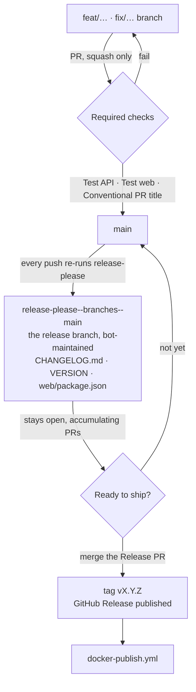
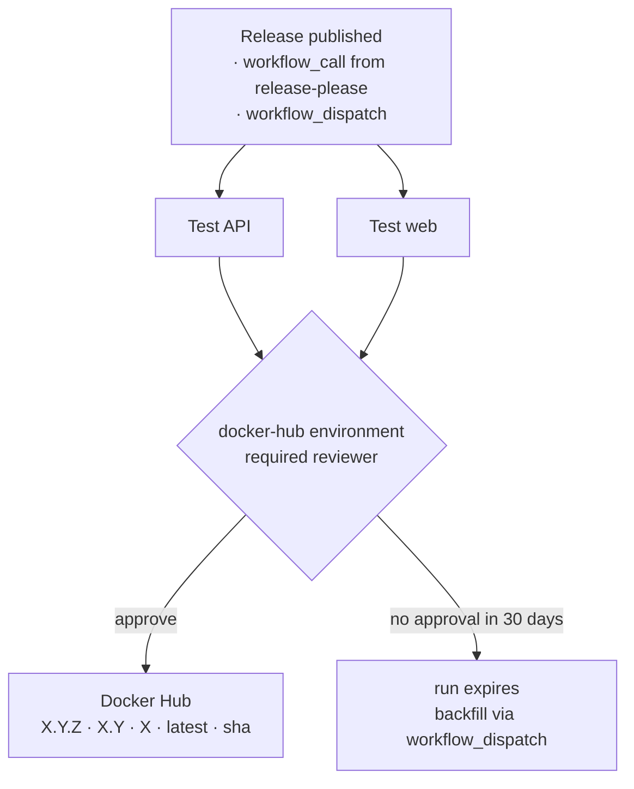

# Release workflow

TraderMemos uses [release-please](https://github.com/googleapis/release-please) for semver, changelogs, and GitHub Releases.



There is no hand-cut release branch: `release-please--branches--main` **is** the
release branch, rebuilt from scratch on every push to `main`. Merging it is the
release. Nothing else tags or publishes.

A GitFlow-style `release/x.y.z` merged into `main` is not possible here and is
not wanted — the ruleset requires linear history and squash-only merges, so the
merge commit it depends on is blocked. Squashing a release branch would also
collapse its commits into one subject, destroying the individual `feat:` / `fix:`
lines release-please reads to build the changelog.

## Day to day

1. Merge PRs to `main` with **Conventional Commit** titles. Merges are
   squash-only and the PR title becomes the commit subject; the
   "Conventional PR title" check blocks non-conventional titles.
2. release-please opens or updates a **Release PR** (`chore: release X.Y.Z`),
   and keeps it current as further PRs land. Leave it open until a release is
   actually wanted — it is a standing draft, not a queue to drain.
3. Review the changelog and version bumps (`VERSION`, `web/package.json`, `CHANGELOG.md`).
4. Merge the Release PR → GitHub Release `vX.Y.Z` is created.
5. Approve the `docker-hub` deployment → Docker images are published.

## Commit messages

| Prefix | Semver bump (pre-1.0) | Example |
|--------|----------------------|---------|
| `fix:` | patch | `fix: healthz version lookup` |
| `feat:` | minor | `feat: about tab updates section` |
| `feat!:` / `fix!:` + `BREAKING CHANGE:` | major | `feat!: remove legacy import API` |
| `chore:`, `docs:`, `refactor:` | none | `chore: bump vite` |

`feat:` bumps **minor** (`0.1.13` → `0.2.0`) and `fix:` bumps **patch**, so the
version says which kind of change shipped. Set
`bump-patch-for-minor-pre-major: true` in `release-please-config.json` to send
pre-1.0 `feat:` back to patch.

### Force a version

Add to the PR description (it becomes the squash-merge commit body):

```text
Release-As: 0.2.0
```

### Release notes granularity

Each release lists the conventional commits merged since the previous tag.
Merging the Release PR after every feature PR yields one-line releases and a
`chore: release` commit between every pair of real ones; letting 5–10 PRs
accumulate yields fuller notes and a readable `main` history. Prefer the latter.

## Version files

| File | Purpose |
|------|---------|
| `VERSION` | Source of truth for API + web builds |
| `web/package.json` | Kept in sync by release-please |
| `CHANGELOG.md` | Human-readable release notes |
| `.release-please-manifest.json` | Last released version (managed by release-please) |

## Docker images

On release, `.github/workflows/release-please.yml` chains `docker-publish.yml` with the new version (same tags as a manual GitHub Release).

You can still run **Publish Docker images** manually via `workflow_dispatch`.

### Approval gate



The `publish` job runs in the **`docker-hub`** environment, which has a required
reviewer. Every path into it — release, `workflow_call`, `workflow_dispatch` —
waits for approval before anything reaches Docker Hub, so publishing is a
deliberate act rather than a side effect of merging the Release PR. The test
jobs run first and ungated, so the approval prompt arrives with CI already green.

Approve from the workflow run page, or the **Deployments** section of the
release. Unapproved runs expire after 30 days; re-run **Publish Docker images**
via `workflow_dispatch` with the version to backfill.

Reviewers live in **Settings → Environments → docker-hub**, not in the workflow
file. `DOCKERHUB_USERNAME` / `DOCKERHUB_TOKEN` remain repo secrets.

## CI gates

`Test API`, `Test web`, and `Conventional PR title` are required status checks
on `main`. The same test jobs are reused by `docker-publish.yml`, so a release
can never publish images that skipped tests.

`main` also carries an active ruleset with no bypass actors: PRs required,
squash-only, linear history, no force-push or deletion. Approvals are set to 0
because the repo is single-maintainer — CI is the gate, not review.
