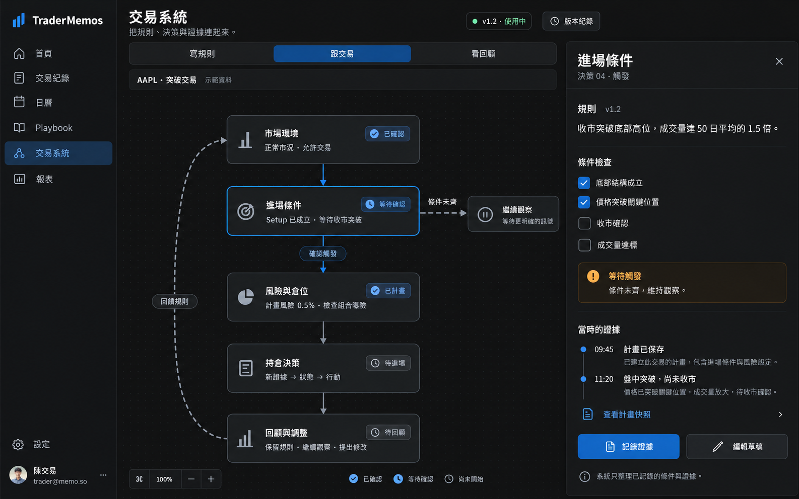

# Trading System Map — 實作計畫

日期：2026-10-10  
狀態：階段 A 完成；階段 B（規則地圖）已實作並對齊垂直草稿（含繼續觀察分支、feedback 邊），腳本化 E2E 案例已完成。跟交易／看回顧模式仍屬 C–E。  
工作分支：`cursor/trading-system-map-f936`

延續 [Trading System Builder](trading-system-builder.md)，將規則、交易決策與回顧放到同一張可操作的系統地圖。既有 API + web 階段 1–3 已有實作，但完整端到端驗收仍未完成；mobile 位於另一 worktree，不在本次 web 實作範圍。

## 1. 產品目標與成功條件

用戶應能在同一個位置回答：

1. 我的交易方法包含哪些決策，哪條規則還不清楚？
2. 這次機會目前走到哪一步，下一步要確認什麼？
3. 當時記錄了什麼證據，實際是否符合規則？
4. 回顧後應保留、觀察、改善執行、修改或暫停哪條規則？

第一個交付目標是完整的「查看地圖 → 選擇決策 → 編輯草稿 → 保存／取消 → 重開讀回 → 啟用版本」循環。後續交付事前計畫、證據時間線和回顧閉環。每個階段獨立驗收，不用未實作的控制或示範數字冒充功能。

成功衡量：首次完成計畫—交易—回顧循環、交易連結計畫的比例、回顧是否有明確下一步、再次遇到相同決策時是否使用前次調整，以及記錄耗時與放棄位置。版本數、填寫量不能單独代表成功。

## 2. 視覺參考與設計約束



效果圖由內建 imagegen 生成，prompt 方向為：Traditional Chinese desktop TraderMemos UI；charcoal、blue primary、五個固定決策節點、等待分支、右側規則與證據 inspector。這是方向參考，實作以 `DESIGN.md` 為準，不照搬圖片中的裝飾邊框、漸層或未有資料支持的狀態。

- 使用現有 coss / Base UI、Tailwind tokens、系統字體與 Lucide。
- Shell、節點和 panel 以背景層次、留白區隔；選中節點可使用藍色 ring。
- 藍色＝目前選擇／主要操作；琥珀＝待確認；紅綠保留給盈虧。文字與圖示共同表達狀態。
- 正常與 Defensive 都允許交易；Paused 才表示暫停。既有診斷修正必須保留。
- 動畫約 150ms，尊重 reduced motion；不以動畫初始透明狀態隱藏必要內容。
- 完整支援明暗主題、鍵盤操作、繁中／英文／日文／韓文與長文字。

## 3. 資訊架構

固定五個節點，沿用現有 16 個 decision IDs，不重新命名已保存的鍵。

| 地圖節點 | 既有 decision IDs | 詳情內容 |
| --- | --- | --- |
| 市場環境 | market | 適用市況、正常／減倉／暫停、未解問題 |
| 進場條件 | selection, setup, trigger | 選股、Setup、觸發、條件確認 |
| 風險與倉位 | risk_budget, trade_risk, position_size, portfolio | 規則與已有風險資料；缺資料明示 |
| 持倉決策 | scaling, definition, evidence, diagnosis, action | 交易假設、持倉期限、證據、狀態、行動 |
| 回顧與調整 | measure, review, adjust | 執行與結果、待查問題、回顧決定 |

「條件未齊 → 繼續觀察」是進場節點的分支，不是失敗狀態。暫停、放棄、資料不足都要有明確位置。

三個模式共用穩定節點 ID 與順序：

- **寫規則**：現有版本與草稿、規則是否已寫／待釐清、未解問題。
- **跟交易**：選定機會／交易的確認項、計畫來源、證據與當前階段。
- **看回顧**：目前日期／帳戶／版本範圍內，各決策的已知偏離及資料覆蓋；點擊深入交易。

地圖連線表達決策關係，不代表系統自動確認行情或會執行訂單。未有紀錄不推斷為通過或違規。

## 4. 技術方案

- 新增 `@xyflow/react` 作桌面互動地圖。固定座標、可點選、縮放／fit view；第一版關閉拖動、任意接線和刪除節點。
- 五個固定節點暫不引入 Dagre / ELK。真正需要動態分支排列才評估加入。
- 節點內使用現有 React UI 元件；Motion 只處理 panel 和內容切換，不與 React Flow 競爭控制節點 transform。
- 小螢幕使用直向決策卡和單一詳情畫面，避免縮小整張 canvas。共用 domain view model，分開 renderer。
- 既有 TanStack Query 管理伺服器狀態；草稿表單採局部編輯狀態。保存成功後同步伺服器正規化結果，失敗保留輸入；保存期間避免重複送出及誤清除較新的編輯。
- 規則／版本／計畫／證據與 React Flow 的座標分開。節點是 domain data 的投影，不把 canvas JSON 當核心交易資料。
- URL 保存模式、選中節點、版本及交易等適用 context；驗證參數、無效值回退、重新整理和返回能恢復位置。
- 地圖採 route-level lazy loading；保留可用的載入、錯誤、重試和空狀態。

建議模組：

```text
web/src/lib/system-map.ts                  # 分组、狀態投影、狀態優先序
web/src/components/system-map/
  SystemMap.tsx                           # desktop React Flow
  SystemNode.tsx                          # 自訂節點
  SystemMapList.tsx                       # 小螢幕直向卡
  SystemInspector.tsx                     # 詳情容器與 responsive 行為
  RuleEditor.tsx                          # 共用規則草稿表單
  DecisionTimeline.tsx                    # 後續證據時間線
web/src/app/screens/SystemView.tsx         # 模式、context、版本協調
```

## 5. 狀態與保存規則

規則清楚、執行符合、方法有效是三個不同維度，不能用一個綠勾涵蓋。

- 寫規則：未填／待釐清／已自評清楚。自評清楚不是方法已被驗證。
- 跟交易：未開始／待確認／符合／不符合／不適用。缺答案顯示待確認；只有適用且已回答的條件能參與符合率。
- 看回顧：顯示分子、分母、未知數量、來源與範圍。少量或缺失資料不給「可靠」結論。
- 系統版本狀態沿用 draft / active / retired；active 與 retired 內容唯讀。
- 明確 Save / Cancel；切換節點、模式、版本或離開時若有未保存修改，提供保存／放棄／繼續編輯。
- Cancel 恢復已保存資料；重新進入不帶入上次放棄的值。Reset 編輯內容與 Discard 整個 draft 是不同操作。
- 第一次保存某欄位不能證明後續新增內容也是事前計畫。

## 6. 分階段實作

### A. 整理既有能力與分析正確性

- [x] 盤點既有 API、規則編輯、版本啟用、每日市況、system card、review，更新原 spec 的已實作／缺失清單。
- [x] 驗證並保留 Defensive / Paused 診斷回歸測試。
- [x] 修正四週進度文案或計算：未檢查風險的 live trade count 不稱為小倉驗證；第二版啟用不等於完成回顧。
- [x] 移除固定 30 筆即「可靠」的保證式措辭，呈現樣本數與限制。
- [x] 在錯過機會有資格與版本歸屬資料前，分開顯示 hesitated misses，不混入所選版本的遵守率。
- [x] 檢查跨幣別彙總、日期／帳戶／版本篩選一致性；無法合理合併的金額要求選定帳戶或使用既有換算規則。

完成條件：現有分析不以未測量的代理值宣稱完成／有效；基礎 API 與 UI 回歸通過。

### B. 第一個可交付版本：規則地圖

- [x] 固定五節點、分支（繼續觀察／feedback 邊）、選中狀態、fit view、鍵盤選取；視覺對齊垂直草稿。
- [x] 右側詳情與手機直向卡；將現有 16 個規則編輯器拆成共用元件。
- [x] 系統空狀態提供四個起始問題：進場、風險、離場、暫停；其餘決策逐步補齊。
- [x] 保留 vague-wording 提示、自評、未解問題、regime labels 與 trade types。
- [x] 保存、取消、重設未保存修改、切換時防丟資料、discard 確認與取消。
- [x] 版本選擇、啟用、每項修改原因、唯讀歷史與差異查看。
- [x] 無 active version、只有 draft、只有歷史、載入失敗等狀態。
- [x] 尚未完成的模式入口不顯示為可用功能；每個模式到其完整階段才開放。

完成條件：用戶從空系統建立規則，保存重開、取消修改、啟用、建立下一版、查看舊版都能走通。第一版不依賴新增交易資料模型。

### C. 跟交易：事前計畫與條件確認

- [x] 新增獨立於 trade 的 opportunity / plan，允許成交前記錄，再由用戶確認連結匯入交易。
- [x] 計畫保存 system_version_id、symbol、direction、setup、適用條件、假設、觸發、失效條件與已有的 sizing 資料。
- [x] 不可變的計畫 revision：保存 server recorded_at、用戶 reported occurred_at、source；修改追加 revision，不能覆寫原快照。
- [x] 狀態 planned / waiting / taken / skipped / cancelled；明確允許的轉換與原因。編輯取消不等於取消機會。
- [x] 条件採未回答／是／否／不適用，保留依據及記錄時間。答案一律是作者判斷，不從已知資料自動填。
- [x] 成交連結需確認；不能只用 symbol 自動配對。解除／重新連結保留歷史並限制擁有權。
- [ ] 舊卡片來源標記為 legacy / retrospective，未知事前狀態不補造。
- [x] API、SQLite/Postgres migrations、OpenAPI、web types 一起更新；編號實作前檢查，避免與其他 worktree 衝突。

完成條件：無成交也可保存計畫、等待或放棄；成交後連結、讀回、解除與重新連結正確；事後修改不改寫原計畫證據。

### D. 持倉證據與決策時間線

- [ ] 每則記錄包含 decision_id、支持／削弱／不確定、證據文字、state、action、記錄與事件時間。
- [ ] state：wrong / still_working / not_working / finished；action：hold / add / trim / take_profit / exit。行動記錄不等於 broker order。
- [ ] 允許回顧補記，清楚標示來源；更正以 revision／撤回紀錄保留歷史。
- [ ] 加減倉顯示當時版本的 scaling 規則；不自動把合理例外當違規。
- [ ] planned hold / time stop 到期顯示待確認問題，不自動診斷或離場。

完成條件：新增、取消、更正、重開讀回以及所有狀態的可用轉換經真實點擊驗證。

### E. 地圖回顧與調整閉環

- [ ] 偏離定位到 decision_id，區分忘記、情緒、操作限制、規則不清楚或合理例外。
- [ ] 地圖顯示決策層級的符合／偏離／未知數量，點擊可深入來源交易。
- [ ] 四象限用符合／偏離規則，不直接稱對／錯；明示損益為零的處理。
- [ ] 回顧新增 keep / observe / improve_execution / revise / pause 決定，附原因、證據與下次檢視條件。
- [ ] 「完成回顧」來自已保存的回顧決定；keep 也能完成，不要求啟用新版本。
- [ ] revise 帶著 decision_id 與 evidence IDs 進入草稿；啟用仍要求逐項原因。
- [ ] 比較版本同時呈現期間、sample、setup／regime 分布、來源與覆蓋，不宣稱版本導致收益變化。

完成條件：從地圖問題深入交易、形成回顧決定、保留原規則或提出新草稿，兩種路徑均完整可用。

## 7. 明確延後

- 自由畫布編輯、任意接線、自訂流程執行引擎。
- 自動辨識市況、AI 判定規則有效、下單或自動執行。
- 多套 active 系統的管理 UI（保留未來擴充空間）。
- 組合關聯分析、複雜自動排版和協作編輯。
- Expo mobile port；手機網頁 responsive 仍屬本計畫。

## 8. 驗證與交付門檻

依 `AGENTS.md`，每個新增或修改的 UI 都必須用真實 tap 測試並保存每一步截圖，不能以 typecheck、lint 或 accessibility tree 代替。

環境：`Pixel_10_Pro`、固定 `adb -s emulator-5554`，Chrome 開 web；另以桌面瀏覽器驗證桌面 layout 與鍵盤。從本 worktree 啟動 throwaway API + DB，確認 Server / API base 和網路回應。以 sharp fixtures 測試：正常／Defensive／Paused、兩個版本、不同日期與帳戶、符合／偏離／未知、無交易、零損益與事後補記。

| 範圍 | 必須走過的路徑 |
| --- | --- |
| 地圖 | 每個節點進入與返回、模式切換、縮放與 reset、手機重新進入、鍵盤與 focus |
| 規則 | 空值、具體／模糊文字、toggle 雙向、save、cancel、reset、re-entry、失敗後重試 |
| 版本 | draft → active → retired、變更原因不足、取消啟用、舊版唯讀、discard 確認與取消 |
| 計畫 | 建立、等待、放棄、連結、解除、重新連結、取消、原快照讀回 |
| 證據 | 新增、各狀態／行動、更正、取消、時間與來源讀回、錯誤恢復 |
| 回顧 | 排除資料的反向篩選、空結果、清除篩選、重開、keep 與 revise 等全部決定 |
| 共通 | 載入／空／錯誤、網路失敗不丟輸入、連續點擊、長文字、所有 locale、明暗與 reduced motion |

API/domain tests 覆蓋版本擁有權、跨用戶隔離、不可變快照、條件 tri-state、錯過資格與分母、篩選、遷移與 legacy 相容。web unit tests 聚焦狀態投影和資料正確性，不寫只重複 JSX 的測試。

每階段執行適當的 Go tests、web typecheck / `vp check` / focused tests；有新失敗才擴大查驗。建立 QA 紀錄，逐項連到 screenshot、fixture 與結果。所有未測路徑列為未完成；不開 PR 或宣稱該 UI 階段已完成。

## 9. 建議落地順序

1. 完成 A，確立分析與狀態語意。
2. 完成 B，交付可操作且通過 E2E 的規則地圖。
3. 完成 C，解決真實事前計畫的入口與證據來源。
4. 完成 D，累積決策層級證據。
5. 完成 E，連成可保留規則、亦可提出修改的完整回顧循環。

先以端到端完成的垂直功能逐步交付。React Flow 效果圖不是完成標準，保存與取消後用戶讀到的狀態才是。
